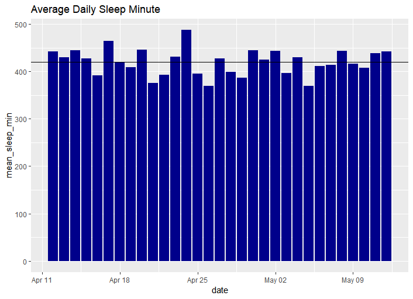
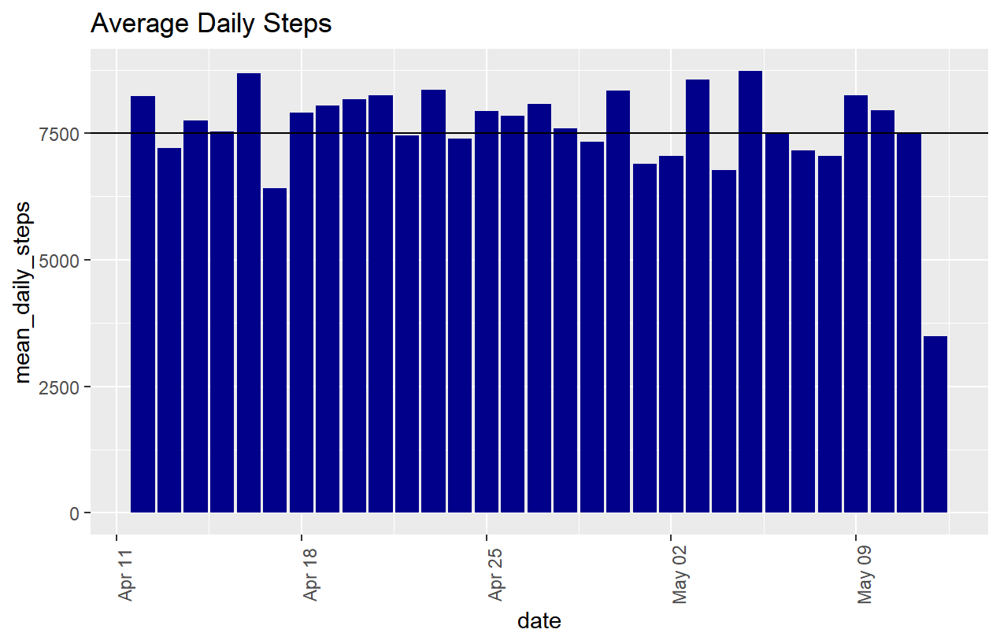
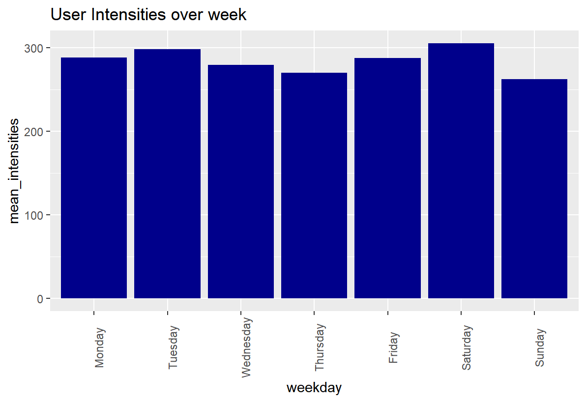
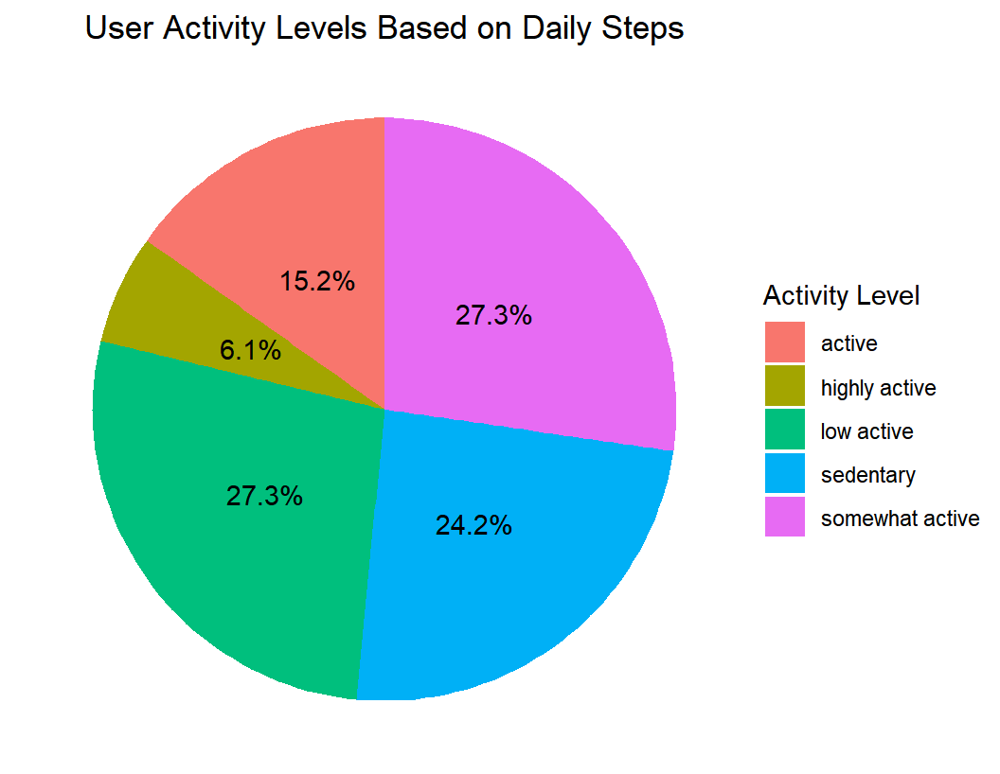

# Bellabeat Case Study: Smart Device Usage Analysis

##  Overview
This case study analyzes FitBit fitness tracker data to identify trends in smart device usage and provide data-driven recommendations for Bellabeat's marketing strategy.

##  Business Task
Identify potential opportunities for growth and recommendations for Bellabeat marketing strategy improvement based on trends in smart device usage.

##  Dataset
The analysis uses FitBit Fitness Tracker Data (CC0: Public Domain) available on Kaggle, containing 18 tables tracking:
- Daily activity
- Sleep patterns
- Heart rate
- Step counts
- Caloric expenditure

**Key Limitations:**
- Small sample size (33 users)
- No demographic data
- Limited to 2 months (2016)
- Potential sampling bias

##  Key Findings

###  Sleep Patterns

- 50% of days showed users averaging <7 hours sleep (below recommended guidelines)

###  Physical Activity

- 33% of days failed to meet 7,500 recommended steps
- User classification:
  - 50% low-active/sedentary (<7,500 steps/day)
  - 25% somewhat active (7,500-9,999 steps/day)
  - 25% active/highly active (10,000+ steps/day)

###  Weekly Patterns

- Highest activity: Saturdays
- Lowest activity: Sundays

###  Device Engagement

- 6% frequent users (21-31 days)
- 69% regular users (10-20 days)
- 26% occasional users (<10 days)

##  Recommendations

### 1. Sleep Health Features
- Implement sleep coaching with personalized reminders
- Add sleep quality insights and improvement tips
- Develop wind-down routines in app

### 2. Activity Motivation
- Create step challenges with progressive goals
- Add social sharing features for accountability
- Implement "move reminders" for sedentary users

### 3. Weekend Optimization
- Saturday: Promote group challenges
- Sunday: Gentle activity suggestions (yoga, walking)
- Weekend-specific content series

### 4. User Engagement
- Targeted re-engagement campaigns for occasional users
- Loyalty rewards for frequent users
- Simplified onboarding for new users

### 5. Product Development
- Consider menstrual cycle tracking integration
- Develop corporate wellness partnerships
- Create family/group tracking features

